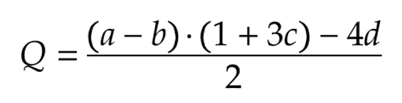
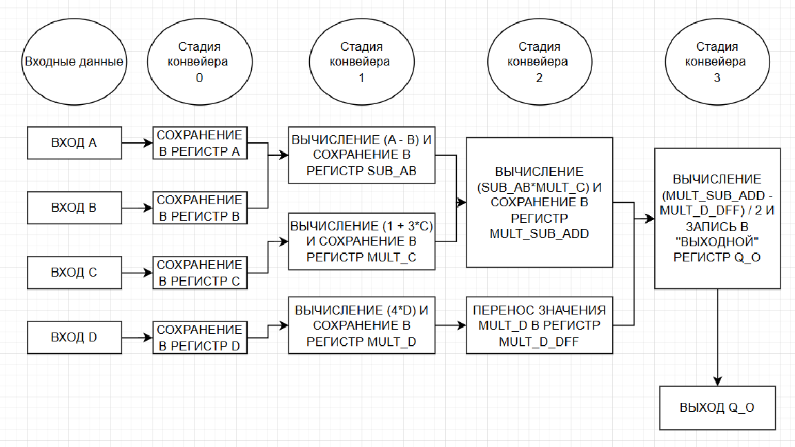
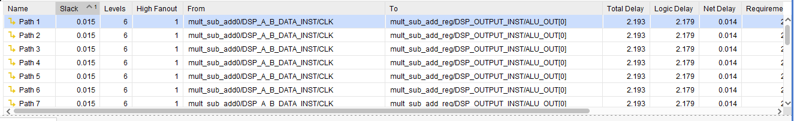
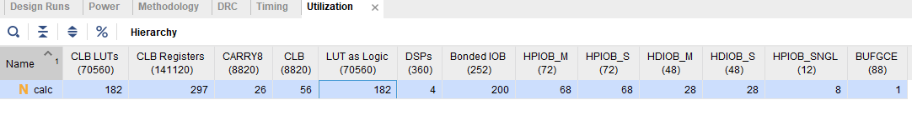

## Реализация математического выражения на FPGA



#### 											Структура блока calc.sv


​	Блок вычисления Q реализован через конвейер в 4 стадии, при этом 0-я стадия опциональна.

0. Сначала данные со входа модуля пишутся в регистры, так как не известно, входные данные идут с "тяжелой" логики или сразу регистров. Вдруг их нельзя сразу обрабатывать, чтобы сохранить положительные тайминги?

1) Вычисляются значения a-b, 1+3c и 4d, пишутся в регистры. При этом 4d можно перенести на 2-ю стадию конвейера, а на 1-й сохранить значение из 0-й стадии, сохранив таким образом немного логики: умножение на 4 требует для защиты от переполнения ширину регистра на 2 бита больше.
2) Происходит перенос значения 4d на следующую стадию конвейера и вычисление значения скобок (a-b)*(1+3c).
3) Финальное вычисление: из результата перемножения скобок вычитается 4d и выражение делится на 2. Результат пишется в регистр q_o.

-----

​	В целом блок вычислений можно уместить в 3 стадии (с учетом сохранения входных данных в регистры), совместив какие-либо выражения из разных стадий в одну, однако операция умножения скобок достаточно тяжелая и занимает много времени, далее рассмотрено в небольшом отчете по имплементации на FPGA. Поэтому выбрал оптимальный вариант в 3 стадии +  1 на сохранение входных регистров.

### 	Защита от переполнения

Для защиты от ошибок переполнения часто используется способ расширения ширины регистров с учетом максимальной ширины результата выражения. Собственно, я так и поступил. 

Можно использовать конструкции для контроля переполнения по типу такого: {overflow, sum} = a + b; То есть проверить наличие единиц в overflow, например.

Существует вариант использования обрезания результата выражения по определенной границе. То есть если результат выражения 515 или 533236, а записать можно только 512 (или 511, если signed), то запишется 512 (511). 

Есть способ слежения за переполнением через изменение знака: если суммируются 2 положительных числа и результат становится отрицательным (ведущий бит стал 1 вместо 0), то произошло переполнение.

### 	Оценка аппаратной имплементации

**Чип: xczu3eg-sfvc784-2-i**

##### Констрейны:

```
create_clock -name clk -period 2.5 [get_ports clk] # 400 MHz

set_clock_uncertainty -setup 0.2 [get_clocks clk]
set_clock_uncertainty -hold  0.1 [get_clocks clk]

...
```

​	Ранее уже говорил, что блок умножения скобок, вероятно, самый тяжелый в модуле. Конечно, все зависит от ширины входных данных, задаваемой параметрами, и тем не менее. Результаты синтеза и имплементации представлены для ширины a, b, c, d = 32 бит, что возможно избыточно в контексте ЦОС. 



Как видно на изображении, широкое умножение еле-еле влезает в тайминги, съедает больше 2ns logic delay, а в жизни еще и net delay может быть очень большим при использовании разных модулей в проекте и высокой утилизации чипа. Тем не менее, модуль развелся с positive slack = 0.015ns на частоте 400 МГц, что является хорошим результатом :)



Использование ресурсов так же небольшое: фактически регистры не дублируются, лишние LUTы не используются, если посмотреть на ширину данных в каждом конвейере и операции с ними. Все 4 DSP были потрачены на работу с умножением скобок. При этом умножение на 3 числа c и на 4 числа было реализовано через логику без использования умножения в целях экономии DSP-блоков.

В результате реальная частота работы схемы в пределах 400 МГц для US+ (для худшего спидгрейда - меньше), потребление ресурсов оптимальное. Если смотреть на отчет после синтеза до имплементации, то есть небольшой отрицательный slack в -0.058 ns.